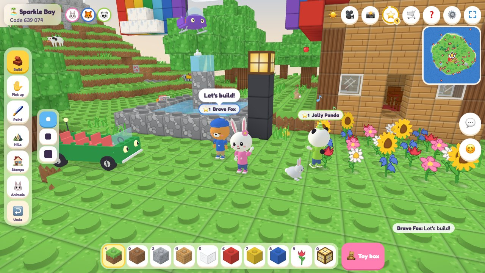

# Kids World

A cozy 3D block-building island game for kids, to play together in the browser. Build with toy bricks, raise hills, put up huge tents, plant fruit trees, dig for jewels in the mines, invite bunnies and ducks to move in, bring a pet of your own everywhere you go, ride ponies, elephants, unicorns and dolphins, drive a car, a boat, a digger and a mine cart, take your friends along in a bus or a ferry, fly a helicopter, a hot-air balloon and a giant mosquito, sit down to a tea party together, visit your friends' islands, free adventure islands from grumpy monsters together, and build towers to keep them off the Star Stone. Everything is made of little studded bricks.

**Play now:** <https://ctbot000.github.io/kids-world/>



1. Press **Make an island**, pick a kind of island (Sunny, Snowy, Candy or Flat Land) and how big it is (Cozy, Big or Huge), and name it: type any name, or roll one with 🎲. Turn on **⚔️ Adventure** for monster camps to free with friends, **🗼 Tower defense** for waves of monsters to see off with towers, or **👾 Monsters** if you want some about.
2. Tell a friend your six-digit **island code** (it's at the top of the screen). They press **Visit a friend** and type it in, or pick your island from **🌍 Islands open now** under it. Up to 8 players can be on one island together.
3. Build together. Your island is saved on your device, and **My islands** opens it again later. While the [island keeper](#the-island-keeper) is online, it keeps a copy too, and **🔑 Log in** brings you and your islands to your other devices.

## What you can do

- **Build** with 16 colours of toy bricks, plus grass, sand, snow, wood, glass, lamps, star blocks, tent cloth, cookies, candy canes, flowers and more. There are over 80 blocks and plants in the toy box.
- **Tools:** Build, Pick up, Paint and Hills (raise, dig or flatten the land), each in three sizes, and Undo.
- **Interior design:** the toy box's 🛋️ **Home** tab has carpets in four colours, a wood floor, checked tiles and four wallpapers, and furniture: a chair, a sofa, a bed, a bookshelf, a kitchen counter, a stove, a fridge, a TV, a fireplace that glows, a picture for the wall, a table, a tea table laid with a teapot, cups and cookies, a floor lamp and a potted plant. Furniture turns to face you as you put it down (a picture faces out from the wall you put it on), and sofas, kitchen counters and tables side by side, or beds one behind the other, join up into one long one. Light and the view go round it, and you can stand on it; lamps and the fireplace light up the room at night. Walk up to a chair or a sofa and tap 🪑 **Sit** beside it (or press <kbd>Q</kbd>) to sit on it, facing the way it faces, or to a bed and tap 🛏️ **Lie down** to snuggle up in it, eyes closed (curled up on your side in a bed one block long, stretched out in two or more joined); walk, jump, <kbd>Shift</kbd> or <kbd>Q</kbd> gets you up again, in front of it, and friends see you sit and lie down. Sit down at a tea table while a friend sits at one too, and it's a tea party, with hearts over the table. Put down ten pieces for the 🛋️ Home Sweet Home sticker, sit down once for 🪑 Comfy Spot, and sit down to tea with a friend for 🫖 Tea Party.
- **Stamps** put down a whole build in one tap: a cozy house (furnished inside), a castle tower, a bouncy castle, a huge circus tent and camping tent, a rainbow, a fountain, a sail boat, a snowman, a flower garden, a picnic, a tea party and more.
- **Animal friends:** bunnies hop, chicks peck, sheep graze and ducks paddle. Up in the air, birds flit between the treetops, the roofs and the grass, owls sleep in a tree all day and come out at night, bees go from flower to flower, seagulls circle high over the beach and butterflies flutter, and giant mosquitos drone slowly about, hanging in the air and now and then dipping down to sip at a flower — they never bite. Pet them for hearts. Give one a fruit and it follows you around, and a flying friend sits on your head when you stand still. With the Animals tool you can invite new friends to move in.
- **A pet of your own:** pick one in **🐾 My pet** (on the title screen, or in ⚙️ Settings on an island): a puppy, a kitten, a bunny, a hamster, a piglet, a duckling, a parrot or a baby dragon, in the colour you like, with any name you type (or roll one with 🎲). It wears a collar the colour of your T-shirt and comes along to every island you go to, yours or a friend's, and friends see it too. It trots along behind you the way you went, runs to catch up, hops up steps and swims after you; when you stop it comes to sit beside you, looking up at you, lies down after a while and falls asleep at night. A parrot sits on your head when you stand still (beside you if a bird is already there), and a baby dragon flies round you and lands beside you. On a ride it rides along with you, behind you on the animal or in the vehicle, and hops down when you get off. Left far behind, or stuck somewhere it cannot follow, it pops over to you. It does what you do: wave and it begs, dance and it spins round, cheer or clap and it jumps, giggle and it rolls over. Tap anyone's pet to pet it, or give it a fruit from your basket, and its owner hears who did. While you choose in My pet, it sits in front of you for you to see.
- **Sea creatures:** schools of fish dart about the shallows (one jumps out now and then), dolphins leap out of the sea, a whale swims out in the deep and blows water out of its blowhole, crabs walk sideways along the beach, turtles bask on the sand and paddle in the sea, and an octopus sits on the sea floor and changes colour when you pet it. Swim out to meet them; fed a fruit, a sea creature follows you as far as the water goes. Snowy islands have a little colony of penguins, which waddle, slide on their tummies and dive and leap in the sea, and seals, which lie about on the shore, clap their flippers, play with a ball and swim.
- **Big animals to ride:** ponies gallop about and cows graze, an elephant flaps its ears and a giraffe looks over the treetops; snowy islands have reindeer (one now and then with a shiny red nose) and polar bears that love a swim, and candy islands have unicorns. Giant mosquitos, as big as a pony, drone about every island but the snowy ones. Walk up to one and tap **Ride** beside it (or press <kbd>Q</kbd>): you steer it as you walk, faster than you can run, and it jumps higher than you can (the elephant sprays water from its trunk instead), swims, and climbs out onto the bank. Swim out to a dolphin or the whale to ride them too: a dolphin leaps out of the sea with you on its back, and the whale blows water over you. On a giant mosquito, hold jump and it flies up into the sky (quicker than the balloon, slower than the helicopter), <kbd>Shift</kbd> or ⬇️ brings it down, and with neither it hangs right where it is; get off up in the air and you fly, and the mosquito drones off by itself. The saddle is the colour of your T-shirt, and friends see you ride. <kbd>Q</kbd> or 👋 **Get off** (or <kbd>Shift</kbd> or ⬇️, on land) gets you down beside it, where it stays a while; fed a fruit, a big animal follows you too.
- **Vehicles to drive:** every island has a toy car, a speedboat by the shore and a yellow digger, and every mine has rails down the middle with a mine cart at its doorway. Walk up to one and tap **Drive** beside it (or press <kbd>Q</kbd>), and steer it as you walk. The car is the fastest thing on land and hops up a step; the boat goes anywhere there is water, and never out of it; jump honks the horn (the mine cart rings its bell), and everyone hears it. The digger digs through the ground it drives into, three blocks wide and three high: hold jump to dig up a step at a time, or <kbd>Shift</kbd> or ⬇️ to dig down, and any jewels it digs out go in your basket. It never digs through anything anyone built. A mine cart rolls along its rails, round corners and up and down slopes, and on by itself when you let go, faster downhill; pull back to stop it or go the other way, and at a fork it goes the way you push. Put down more **Rails** from the toy box (they join up by themselves, and a rail a step higher makes a slope), and bring more vehicles from its 🚗 **Vehicles** tab. <kbd>Q</kbd> or 👋 **Get out** gets you out beside it, where it stays; tap a vehicle and it honks.
- **Riding together:** every island also has an open-top bus near where everyone comes in and a ferry out on the sea, each with six seats for friends behind the driver's. The first one on drives; everyone else walks up and taps **Hop on** (or presses <kbd>Q</kbd>) to sit in the next free seat, and rides along wherever the driver goes, seen in their seat by everyone. Riding along, jump honks too, and <kbd>Q</kbd> or 👋 **Get out** gets you out beside it. When the driver gets out, the others stay in their seats until somebody else takes the wheel. Each seat turns the colour of the T-shirt of whoever sits in it.
- **Flying:** every island also has a helicopter and a hot-air balloon near where everyone comes in. Get in and hold jump to take off and fly up, steer as you walk, and hold <kbd>Shift</kbd> or ⬇️ to come down; let go of both and it hovers, and it lands when it comes down onto the ground (or floats, onto water). The helicopter is quick, its rotor whirring, with a seat for two friends behind the pilot; the balloon drifts slowly, its burner roaring as it climbs, with room for four friends in its basket. Friends hop on the way they do in the bus. Get out up in the air and you fly, and the helicopter or the balloon you left comes gently down by itself.
- **Elevators:** put down **Elevator** pads from the toy box (Building) in a column, one above the other, or use the 🛗 **Elevator Tower** stamp. Stand on a pad and jump to ride up to the next pad above, or press <kbd>Shift</kbd> (⬇️) to ride down to the one below; you glide through anything in between, and friends see you go.
- **Trampolines:** put down **Trampoline** blocks from the toy box (Building), or use the 🤸 **Bouncy Castle** stamp, a floor of them inside soft walls. Jump on one and you bounce back up, lower each time until you stop; hold jump and you bounce higher and higher instead, up to eight blocks high. <kbd>Shift</kbd> (⬇️) stops you on the next bounce. Friends see you bounce.
- **Huge tents:** stamp a 🎪 **Circus Tent**, a big top 23 blocks across and 20 high in red and white stripes, with a star on its pole, a striped porch at the way in, and inside a ring of trampolines round the pole, stars all round the ring and benches in rows behind it; or a ⛺ **Camping Tent** with a porch, lanterns and a sleeping bag for each of eight friends. Or make your own with **Tent Cloth** in eight colours (toy box, Building): anywhere with tent cloth over it is in a tent. Be in a tent at night for a camp out, and no monster ever comes in.
- **Treasures:** pick fruit from the trees (every island has its own fruit), find seashells on the beach, and catch star pieces after a shooting star. Plant a fruit and it grows into a tree; sprouts grow into trees too.
- **🛒 Shop:** sell what is in your basket for 🪙 coins (a fruit is 1, a seashell 2, a star piece 5, a ruby or sapphire 10, an emerald 12, an amethyst 15 and a diamond 50), one at a time or all of a kind, and spend them on gear that makes you faster: **running shoes** (👟 Bouncy Sneakers, ⚡ Zoomy Sneakers, 🚀 Rocket Boots) for walking, running and swimming, **flying gear** (🪶 Feather Wings, 🧚 Fairy Wings, 🛩️ Jet Pack) for the sky, up and down too, and **toy weapons** for monsters: a 🗡️ Foam Sword (40 coins) pops one in two bops and reaches a step further than your arm, a 🫧 Bubble Blaster (100) in two bubbles from a few steps away, and a 🔨 Star Hammer (250) in one bop from right up close, and King Grumble feels each of its bops twice. Each level is bought after the one before and is better than it; shoes and wings make you up to two thirds faster than anyone else. Friends see your weapon in your hand, and see you swing it as you bop: a punch, a slash with the sword, the hammer up over your head and down, or the blaster raised to aim, each with your body behind it. You wear the best you have, and **Take off** puts it away until you want it again. It's on the title screen, in ⭐ Stickers, and on the 🛒 button on an island (except on a phone held upright); your coins and gear come along to every island, and with a login to your other devices too.
- **Jewels and mines:** rubies, sapphires, emeralds, amethysts and diamonds hide in sparkly gem rocks. Every island with mountains has a mine dug into one: a path up to a wooden doorway, then a tunnel lit by lamps with jewels in its walls, and at its very end a diamond. More are hidden deep in the rock all over the island (on Flat Land too) for anyone who digs down far enough, and a few lie out on the stony mountain tops. Tap a gem rock with any tool and its jewel pops into your basket; put one down from the basket and it sparkles on the ground, even at night. Finding is for keeps: Undo does not put a jewel back to be found again.
- **Day and night:** a long day and a short, gentle night where lamps glow. There's rain, snow or candy sprinkles, and a rainbow afterwards.
- **Your character:** be a kid, with your skin, a hair style (short, spiky, curly, a bob, long, a ponytail, pigtails or a bun) and a hair colour, or a grown-up, a head taller, with all the same and glasses, a moustache or a beard if you like, or a bunny, cat, bear, puppy, fox, panda, frog, piggy, mouse or koala in the fur you like. Pick a T-shirt and a hat, and a display name, the name friends see: type any you like (or roll a friendly one, like "Sunny Otter", with 🎲). Change it while friends are there and they see it at once. Wave, dance, cheer, clap or giggle, and talk: type anything, or tap a ready-made phrase or a sticker.
- **Log in** (with an [island keeper](#the-island-keeper)): a username of your own, in any language, and a password. Your display name is your username unless you pick another. Logged in, you are the same on every device: your look, stickers, basket, coins, gear and islands come along, and what you build on one is there on the others. What you made on a device before you logged in there comes along too, if you say it's yours. Players who take turns on one tablet each log in and out, and their islands never mix.
- **Monsters, if you want them:** turn on **👾 Monsters** in Make an island, or later in ⚙️ Settings → Island rules, and grumpy jelly blobs hop out round the players (purple on a sunny island, frosty blue on a snowy one, sour green on a candy one): two for each player by day, four at night, when their eyes glow. One that sees you comes after you, and one that bumps into you knocks you back and takes one of your five ❤️ hearts, shown over the hotbar. With none left you pop back to the start of the island with all of them again. Jump on a monster and it goes pop. Or walk right up to one, face it and bop it with <kbd>X</kbd> (or the 👊 button, there on a touch screen while a monster is about): only as far as your arm reaches, or the toy weapon in it, and a tap or click at a monster does nothing but say so. It takes three bops: each knocks it back, and it comes straight back at you, cross and quicker than you walk, so bop again, jump on it or run. Left alone a while, it has all three hearts again. Hearts come back by themselves, one every six seconds nothing bumps you. Monsters never go into the water, a tent or the safe place round the start of the island, cannot reach you in a tent or on an animal's back, and are slower than you run, so running away always works. They are never saved: an island opened again starts without any.
- **Adventure islands:** turn on **⚔️ Adventure** in Make an island, and grumpy monsters have camps all over it: gloomy purple ground behind a fence of logs with a lamp at each way in, and their purple flag in the middle (three camps on a cozy island, five on a big one, seven on a huge one), and furthest from the start, King Grumble's castle, stone walls and towers round his yard. A camp's monsters come out when someone comes near, and keep to their camp, chasing whoever comes in (one more of them than there are friends on the island, up to five). Pop them, then stand by the flag: while none of them is in the camp, the monsters' flag comes down and the island's own sky-blue star flag goes up, in ten seconds for one friend, six for two and four for four or more. Up all the way, the camp is free: its gloomy ground turns back into grass, snow or frosting with flowers coming up, and it is a safe place no monster goes into. A monster popped comes back in a while until then, so friends help each other: one leads the monsters out, the other raises the flag. With every camp free, King Grumble's bubble pops: big and slow, he crouches with a ring on the ground and stomps (jump, and it misses you), then sits dazed for two seconds with stars round his crown, when he bumps nobody and every bop counts three times, so dodge his stomp and rush in. He is too big to knock back, calls little monsters to help him when he is down to two thirds of his hearts, and again at a third, and gets crosser each time: quicker (at the last as quick as you walk) and stomping more often. Leave him alone for eight seconds and he gets a heart back every two. Each friend can bop him about once a second, so the more of you there are, the sooner he goes pop, with fireworks, and the whole island is free, and everyone who helped gets a sticker and a diamond. Out of hearts there with a friend on the island, you sit dizzy, stars going round your head, and nothing bumps you: a friend who comes and taps you helps you up; nobody coming for ten seconds, you go back to the nearest safe place, the start or a camp freed. The map shows every camp's flag and the castle's crown, your hearts show how many camps are free, and the island's card (tap its name) says how each is going. An adventure island shows on **🌍 Islands open now** with how many of its camps are free, for friends to come and help.
- **Tower defense islands:** turn on **🗼 Tower defense** in Make an island (instead of Adventure), and grumpy monsters march out of their gate, under a purple arch as far from the start as there is room for, along a winding road of pebbles three wide (with a bridge where it crosses water) to the island's **🌟 Star Stone**, a column of star blocks a few steps from the start. Beside the road are wooden pads (eight to sixteen, more along a longer road): stand by one and tap **🗼 Build** (or press <kbd>V</kbd>) for a tower of bricks that blows bubbles at the monster furthest on within its reach, a heart off it with each one, and build by it again to make it bigger twice (further, faster, and at the top two hearts a bubble). Towers cost 🧱 bricks: four to start with, one for every monster popped (by a tower or a friend, who can tap or jump on them as anywhere) and a few for every wave seen off. Away from the pads, **🌊 Start** sends the next of ten waves, more monsters with more hearts each time and King Grumble himself, big and slow, in the middle wave and the last. One that gets to the Star Stone takes a heart off it (King Grumble five) and a wave seen off gives two back; with none left the wave goes home and the Star Stone shines again, to try that wave once more. The road, the pads and the Star Stone can't be built on or dug up, so the way is always open; the wave, the Star Stone's hearts and the bricks show above the hotbar, a tag over each pad and the Star Stone, the road on the maps, the island's card and the list of open islands. Marching monsters never bump anyone. After the last wave the island is safe: fireworks, a sticker and a diamond for everyone there.
- **51 stickers** to collect, for things like your first brick, furnishing a home, sitting on a sofa, sitting down to tea with a friend, digging up ten jewels, finding a diamond, petting ten animals, a bird sitting on your head, getting a pet, your pet doing ten tricks, petting a friend's pet, riding a big animal (and a dolphin or the whale), going for a drive, riding along in a bus or a ferry a friend is driving, flying a helicopter or a hot-air balloon, riding an elevator, bouncing on a trampoline, a camp out in a tent, digging a hundred blocks with the digger, rolling a hundred blocks in a mine cart, watching a whale blow water, a penguin's belly slide, popping ten monsters, freeing a monster camp, helping a dizzy friend up, popping King Grumble, building a tower, seeing off every wave of a tower defense island or staying up to see the stars.
- **⭐ Levels:** everything you do earns XP: putting down blocks, finding fruit, shells and jewels, petting and feeding animals, riding, driving, exploring, popping monsters, freeing camps and seeing off waves, and every sticker is 25 more (talking and dancing earn XP only up to a point). Enough XP takes you up a level, with a fanfare and sparkles round you: level 2 takes 100 XP, and each level after a little more than the last, up to level 99. Your level is on the ⭐ Stickers button, with a ring round it filling up to the next, and at the top of ⭐ Stickers, and friends see it on your name tag. It comes from what you have done, so it comes along to every island, and with a login to your other devices too.
- **🏆 Ranking** (with an [island keeper](#the-island-keeper)): players with a login side by side on six boards, for the most stickers, blocks put down, animals petted, treasures found (fruit, shells, star pieces and jewels), steps walked and XP. Each board shows its top ten, with 🥇🥈🥉, and your own place however far down it is. It's live: while it's open, it changes as players play, within a few seconds, and a score that changes pops. It's on the title screen and in ⭐ Stickers.
- **👫 Players** (with an [island keeper](#the-island-keeper)): logged in, see everyone else with a login, the ones playing right now first, by the display name and look friends see. On an island friends can visit, tap the island's name at the top, then **👫 Invite a player**, and **💌 Invite** one who is playing now: a card pops up on their screen saying who invites them where, and **🛶 Let's go!** takes them there. An island owner's invitation lets the friend in without the passcode, once.
- **🤖 An AI friend:** Pip 🤖, a kid in headphones with a baby dragon, comes to play (with [an AI friend running](#the-ai-friend)). It is on the 👫 Players list, playing now whenever it can come, so **💌 Invite** brings it to your island; and now and then it drops in by itself on an island that is open to friends, the loneliest first. It says hello, talks with you in your own language, Korean or English, walks and flies along with you, helps you up when you are dizzy, bops monsters that come at you, puts down a house, a fountain or any other stamp when you ask, pets your pet, waves and dances, and knows how the game works if you ask it. It is honest that it is an AI friend, never asks anything about you (and says to keep it secret if you tell it), and goes home when you say bye, when everyone else has gone, or when the island's owner sends it home. It also has **an island of its own**, Pip's Island, on the list of islands open now: there it builds big things one layer at a time (a castle, a lighthouse, a rocket, a statue of itself, a treehouse, a hedge maze, a Ferris wheel, a rainbow pyramid, a trampoline park, a birthday cake), picking what to build itself, or what you ask it for when you visit.
- **Photos:** the 📸 button saves a picture of your island, without the buttons.
- **A little map** in the corner shows the island from above: you (the yellow arrow) and the way you are looking, your friends in their T-shirt colours, and the animals. Tap it for a big map with everyone's names. It can be switched off in ⚙️ Settings.
- **Sounds and music** are all made in the browser: pops and clicks for building, animal voices, "animal talk" babble when someone speaks, and soft music that changes at night.
- **🎵 Island song:** an island's owner can play an MP3 from their device instead of the island music: ⚙️ Settings → Island rules → **🎵 Pick an MP3** (up to 8 MB). Everyone on the island hears it, round and round at their own music volume, friends who come later too, and **🎶 Island music** brings the island music back. Your own island plays its song again whenever you open it on that device.

## Made for kids

- **Names and talk are yours.** Type any name, in any language, up to 32 characters with nothing invisible in it, or roll a friendly one. An island takes any name too, emoji and all. Two players with the same name on one island are told apart by a number ("Minji 2"). Talk by typing, up to 120 characters in any language, or with ready-made phrases and stickers. 💬 shows what has been said on the island (the last 30 lines, those from before you came too), to read again, and 📋 by a line copies it, to paste into the box or anywhere else. The island's host tidies what it passes on (nothing invisible but the joiners emoji are made of) and slows down anyone who talks too fast.
- **Island codes are six digits**, easy to read out and type, and they never spell a word.
- **The island's owner decides:** friends can be allowed to build or not, the island can be closed to new visitors or given a passcode, monsters can be let in or not, and anyone can be sent home. Undo takes back mistakes.
- **Islands open now.** An island friends can visit is on the list in **Visit a friend**, by its name, its kind and size, and how many are playing, for anyone to pick, the busiest first; it comes off as soon as it is closed to visitors (or to new ones) or its owner leaves. Anyone can come in, unless the owner turns on **🔒 Passcode** in ⚙️ Settings → Island rules: then a new visitor types its four numbers (the owner sees them there and in the island's code card; 🎲 rolls new ones), and the list marks the island 🔒. Friends who came in before come back without it. Only the owner ever sees the passcode, and wrong ones can only be tried a few at a time, then one every ten seconds, so four numbers take days to guess. Peer to peer, the list is kept by the [island keeper](#the-island-keeper) while it is online; on the dedicated server, the server lists the islands with someone on them.
- **The ranking is a choice.** Only players with a login are in it, by the display name and look friends see, never their username. Untick **Show me in the ranking** to leave it (on every device), and a grown-up can take anyone out on the keeper's admin page.
- **Invitations are a choice too.** Only players with a login see the players list or invite anyone, and only from an island open to new visitors. An invitation says nothing but who sent it (by the name the keeper has for them, not one the page claims) and which island; nobody can be invited more than every 15 seconds by one player, and nobody sends more than ten a minute. Untick **Other players can find me and invite me** in 👫 Players to leave the list (on every device): then nobody sees you there or can invite you.
- **No ads or tracking, and no accounts unless you want one.** Your character, stickers and islands are kept in this browser, with a copy at the [island keeper](#the-island-keeper) whenever it's online. ⚙️ Settings → **Safe copies** turns the copies off. A login is only a username and a password, kept by that keeper: no email, and nobody else's computer.
- **Gentle by design:** there are no monsters unless the island's owner turns them on (or makes an adventure or tower defense island), no falling damage and no way to get hurt. Even with monsters, a bump only knocks you back and takes a heart, and hearts come back; out of hearts on an adventure island you just sit dizzy until a friend helps you up. You float in water and can fly anywhere.

## Controls

| | Keyboard and mouse | Touch screen |
| --- | --- | --- |
| Walk | <kbd>W</kbd> <kbd>A</kbd> <kbd>S</kbd> <kbd>D</kbd> or arrows (<kbd>R</kbd> to run) | Thumb on the left side |
| Jump | <kbd>Space</kbd> (you hop up small steps by yourself) | Jump button |
| Fly | <kbd>F</kbd>, then <kbd>Space</kbd> up and <kbd>Shift</kbd> down | Wings button |
| Ride | <kbd>Q</kbd> beside a big animal, a dolphin or the whale; <kbd>Q</kbd> again (or <kbd>Shift</kbd>, on land) to get off | Ride button beside it; 👋 Get off (or ⬇️, on land) |
| Bop a monster | <kbd>X</kbd>, right up close and facing it | 👊 button (it shows while a monster is about, with your toy weapon on it) |
| Build a tower, or Start a wave | <kbd>V</kbd> by a pad beside the road (Start, away from every pad) | 🗼 Build beside the pad; 🌊 Start |
| Drive | <kbd>Q</kbd> beside a vehicle, and again to get out; <kbd>Space</kbd> honks; in the digger, <kbd>Space</kbd> held digs up and <kbd>Shift</kbd> digs down | Drive button beside it; 👋 Get out; jump honks; in the digger, jump digs up and ⬇️ digs down |
| Ride along | <kbd>Q</kbd> beside a bus or ferry someone is driving, and again to get out; <kbd>Space</kbd> honks | Hop on button beside it; 👋 Get out; jump honks |
| Fly a helicopter or balloon | <kbd>Q</kbd> beside it; <kbd>Space</kbd> held flies up and <kbd>Shift</kbd> held comes down | Drive button beside it; jump held flies up and ⬇️ comes down |
| Sit or lie down | <kbd>Q</kbd> beside a chair, a sofa or a bed; walk or <kbd>Q</kbd> again to get up | 🪑 Sit or 🛏️ Lie down beside it; walk or 👋 Get up |
| Elevator | Jump on a pad to go up, <kbd>Shift</kbd> to go down | Jump button to go up, ⬇️ to go down |
| Trampoline | Hold <kbd>Space</kbd> to bounce higher, <kbd>Shift</kbd> to stop | Hold the jump button to bounce higher, ⬇️ to stop |
| Look around | Drag with the mouse, scroll to zoom (all the way in to see through your own eyes) | Drag with a finger, pinch to zoom |
| Use a tool | Click (hold to keep going), right-click to pick up | Tap |
| Blocks | <kbd>1</kbd>–<kbd>0</kbd>, <kbd>E</kbd> opens the toy box, middle-click copies the block you point at | Tap the hotbar |
| Talk, emotes | <kbd>T</kbd> (type, then <kbd>Enter</kbd>), <kbd>G</kbd> | 💬 and 😊 buttons |
| Take a photo | <kbd>P</kbd> | 📸 button |
| Big map | Click the little map | Tap the little map |
| Help a friend up | Click a dizzy friend beside you | Tap a dizzy friend beside you |
| Undo | <kbd>Z</kbd> | ↩️ button |
| Full screen | Full screen button, at the top or in ⚙️ Settings | The same; on an iPhone, add the game to the Home Screen and open it from there |

## Two ways to play together

**Peer to peer (the hosted page).** The browser that makes an island *is* the host: it runs the island, and friends connect to it directly over WebRTC data channels. The free [PeerJS](https://peerjs.com/) server only introduces the browsers to each other; when a direct connection is blocked, traffic goes through the TURN servers in PeerJS's default configuration. The host keeps the tab open while friends play (the island keeps running in a background tab). The island is saved in the host's browser, and reopening it from **My islands** brings it back under the same code, so friends can reconnect.

To use your own signaling server, run a [PeerServer](https://github.com/peers/peerjs-server) (`npx peer --port 9000`) and open the game with `?signal=http://localhost:9000/`. Invite links carry the setting along.

**Dedicated server.** `npm start` serves the game and hosts islands itself over WebSocket, so nobody's browser has to stay open. The page notices the server and switches to it automatically. It serves the game's files with [serve-static](https://github.com/expressjs/serve-static), speaks WebSocket with [ws](https://github.com/websockets/ws), and runs anywhere Node 22+ runs. Islands with nobody on them are kept for two hours. Once it is set up, the same command also runs the [island keeper](#the-island-keeper).

```bash
npm install
```

```bash
npm start
```

Then open <http://localhost:8747/>. To play with others on your network, `npm start -- --host 0.0.0.0` prints the addresses to share; `PORT` and `HOST` work too. Add `?p2p=1` to use peer-to-peer play even when the server is there.

## The island keeper

A computer of your own can keep a copy of every player's islands and of who they are, so nothing is lost when a browser is cleared or a tablet is replaced. Players keep using the hosted page: whenever the keeper is online, their browsers send it what changed since last time, peer to peer, the way friends visit an island. While it is away, the copies wait in each browser for next time.

To make your computer the keeper, once:

```bash
npm run keeper-setup
```

This creates the keeper's peer id and key pair in `~/.kids-world` (or the folder in `--data` or `KIDS_WORLD_DATA`), and writes the public half to `public/keeper.json`, which is how pages find the keeper. Commit and deploy that file. From then on `npm start` puts the keeper online for as long as it runs, and <http://localhost:8747/admin/> shows what it has kept: each player with their stickers and basket, and their islands drawn from above (folded away until opened, the ones said goodbye to folded again inside), with a download of any day's copy and deletes, and where each was last seen from, logged in or not (the IP address their connection uses, a local one for a player on the same network, an IPv6 one with its IPv4 address too when the page offers one or the address carries one, and roughly where a public one is, looked up offline with geoip-lite so no address leaves the computer), and takes a player out of the ranking or puts them back. A downloaded island opens in the game with **My islands → 📂 Open an island file**. The admin pages answer only the computer they run on.

- **Reaching it.** The keeper joins the PeerJS signaling service under the peer id in `keeper.json`, and answers data connections with [node-datachannel](https://github.com/murat-dogan/node-datachannel) (WebRTC for Node, with ready-built binaries for macOS, Linux and Windows). It needs no open ports, no tunnel and no account anywhere.
- **Trusting it.** Anyone can take that peer id while the keeper is away, so a page sends nothing until the keeper has signed the page's fresh random number with the private key whose public half is in `keeper.json`. The data channel is encrypted end to end, as every WebRTC channel is.
- **What it keeps.** Each island's latest copy, and one copy a day for the last 30 days it was played; each player's name, look (with their pet), basket, coins and gear, what they've done and their stickers. Never the tokens that let players back into islands, nor their settings. A browser files its copies under a hash of a secret only it knows, so nobody can overwrite anyone else's. It stops taking copies at 2 GB.
- **Keeping it up to date.** The keeper runs the code of the folder it was started from, so when the game changes, update that folder (`git pull`) and restart `npm start`. A keeper running older code does not know what newer pages ask for, like the ranking: the page says the keeper needs an update, and the keeper's terminal says which request it did not know.
- **Its key.** The private key is in `~/.kids-world/keeper.json`: keep that file private, and back it up with the copies. `npm run keeper-setup -- --new` makes a new one; pages then send nothing until the new `keeper.json` is deployed.
- **Logins.** 🔑 **Log in** → **Make my login** turns the copies a browser has sent into a player you can log in as: a username, 2 to 32 letters, numbers, signs or spaces in any language (one per login, matched in any case and any width of letters, so "Minji", "MINJI" and "ＭＩＮＪＩ" are one username; nothing invisible), and a password typed twice (at least 6 characters, not the username; compared in Unicode NFC, so any keyboard's way of spelling the same letters works). It starts as your display name, and becomes your display name too unless you untick **Use it as my display name too**. Logged in, 🎨 Change me has **Same as my username**: on, the display name is the username; type another and it is your own (🔑 My login → **Use my username instead** goes back). On another device, **Log in** asks for the username and the password; that device gets a token of its own, and from then on it sends its copies to the player and brings back what the player's other devices sent: the newest copy of each island (owned by you there too), the look, name and basket changed last, every sticker and the most of everything done. An island you say goodbye to on one device goes from the others too; the keeper still has its copies. Logging out keeps that player's things on the device, apart from the guest's, for the next time they log in there. The keeper keeps passwords and tokens only as hashes (scrypt and SHA-256); after five wrong tries a name waits ten minutes, and a wrong password and a username with no login get the same answer. A player who forgot their password gets a new one on the admin page, which also takes a login away (every device logged in as them is logged out). Logging in needs the keeper to be online; playing never does.
- **The ranking.** The keeper ranks the players with a login from the profiles their devices sent, whenever a page asks (any page, logged in or not, even with copies off): the top ten on each board by their display name and look, sharing a place on a tie, and the page's own player's place. Only real stickers count, and no count above ten million. It is live: a page showing it asks to watch it, keeps its connection open while it is on screen, and is sent the ranking again within a second of any change that makes it look different to that page (a player's profile, a login made or taken away, someone leaving or joining it). For that, a logged-in page sends what its player has done every 5 seconds while they play, instead of every few minutes. Players who left the ranking, or were taken out of it, are on no board; that choice is kept with the player at the keeper, so it holds on all their devices and through new passwords. Seeing it needs the keeper to be online.
- **Islands open now.** A page hosting an island that friends can visit tells the keeper about it, and stays connected while it is open, so the keeper's list (kept in memory, never on disk) is always the islands open right now; any page asks for it in **Visit a friend**. A keeper running older code does not know the list: the page says it needs an update.
- **Players and invitations.** A logged-in page stays connected while it is on screen and says its player is playing now (kept in memory only, like the open islands), so up to 128 pages can be connected at once. The players list is every login's display name and look, under an id made for the list rather than the folder their copies are in. An invitation goes only to the pages of that player that are on screen right now, and only from a logged-in page; an island owner's carries a pass from the island that lets one friend in without the passcode within half an hour. Leaving the list is kept with the player, like leaving the ranking. A keeper running older code does not know the list: the page says it needs an update.
- **Bringing what was there before.** Everything kids made before logins exist comes along:
  - The device where a player makes their login: everything on it, and the keeper's copies from it, become the login.
  - Another device they played on as a guest: when they log in there, the game asks whether what that guest made is theirs. If it is, its islands, stickers, basket and what it did join the login, on that device and at the keeper (proved by that device's key and the new login's token), and the guest there starts afresh.
  - A device that is gone, say a replaced tablet: on the admin page, **Move into this login** puts its copies into a player's login, and every device logged in as them gets its islands.
  - Logins made in the days of secret pictures keep working on the devices logged in to them, which ask for a password the next time they reach the keeper; the admin page can set one too.
  - Logins from before usernames went by the made-up name: the keeper makes it their username when it starts, so they log in as before. Two of one name keep it both, told apart by their passwords.

## The AI friend

`npm start` also runs **Pip 🤖**, the AI friend. Its words come from Z.ai's GLM models over the internet, with a local [Ollama](https://ollama.com) model to keep answering when Z.ai cannot (no key, no internet, out of credit). For Z.ai, once:

```bash
export ZAI_API_KEY=your-key    # from https://z.ai
```

For the local standby (it falls back to it on its own):

```bash
brew install ollama
```

```bash
brew services start ollama
```

```bash
ollama pull gemma3:4b
```

The terminal says `AI friend: Pip 🤖 is awake` (or why it is asleep: then it is off the players list as playing, and checks again every minute).

- **What it is.** One more player, run by `server/buddy.js` with the game's own engine: it joins an island the way a page does, peer to peer through the same signaling service as the [island keeper](#the-island-keeper) (`server/dialer.js`, the calling side of what the keeper answers), or straight into an island of this dedicated server. Its words come from the model (Z.ai's, or the local Ollama's when Z.ai cannot answer), told the island, who is there and what was said, and answering as JSON (Z.ai's JSON mode, or Ollama's structured outputs), so it always says one short line and picks one thing to do: follow, stay, an emote, build a stamp, pet a pet, or go home. Walking, flying, helping a dizzy friend up and bopping monsters are its own, without the model.
- **Where it goes.** Invited, through the keeper's players list (only with the keeper online), to as many as two islands at once. By itself, every few minutes while it has a free place, to an island on the list of open islands with somebody on it and no passcode, the fewest players first, for a quarter of an hour or so (longer while friends talk with it). It does not go back by itself to an island it was sent home from that day, nor for a while to one where it was told bye.
- **Keeping it kind.** The model is told to be a gentle, cheerful friend for children, to answer in their language, to say honestly that it is an AI friend, never to ask for or repeat anything personal, never to suggest meeting anywhere, and to tell a child who is sad or hurt to talk to a grown-up they trust. Besides that, the friend itself notices a child telling it something personal (a school, an age, an address, a phone number) and has the model say to keep it secret, goes home on a goodbye whatever the model says, and drops any line that asks a child where they live, how old they are or their school.
- **Its own island.** On the server that runs it, it keeps an island of its own, saved in `ai-friend-island.json` in the keeper's data folder (kept over a restart, under the same code, with it as its owner). With the keeper online it is also hosted peer to peer, as a page hosts an island, and is on the keeper's list of open islands, so the game on GitHub Pages can visit it too; without a keeper, only pages of that server see it. When nobody is there it builds something every 6 to 12 minutes, after asking the model what (and in what colour and size), at a flat spot near where everyone comes in, clearing trees and flowers off it first; with friends there it plays with them, and builds on when they ask it to or once nobody has talked with it for a while. It stops when there is no room left.
- **Settings and watching it.** The **AI friend** part of the [admin page](http://localhost:8747/admin/) turns it on or off, names it (from its next visit on), picks one of the models Z.ai has, keeps it to invitations or lets it visit by itself, sets on how many islands it may be at once, and whether it has an island of its own; they apply at once and are saved in `ai-friend.json` in the keeper's data folder. It also shows whether it is awake (or why not), what it is talking with (Z.ai falling back to the local Ollama, and when one of them is down while the other still answers), what it is doing right now on each island it is on (building what, layer by layer, following whom, bopping a monster, thinking what to say or build), its own island with what it is building and has built there, the islands it is on with who is there and what is said, how many answers its model gave and how fast, and what it did lately, with a line to **Say** on each island, which it says there as its own words (the model sees it as something it said, and it is marked as from the admin page there), and **Send home** for each island (it does not go back there by itself for two hours). Until settings are saved there, they come from the environment: `KIDS_WORLD_AI=off` turns it off, `KIDS_WORLD_AI_WANDER=off` keeps it to invitations, `KIDS_WORLD_AI_HOME=off` gives it no island of its own, `KIDS_WORLD_AI_NAME` names it, `KIDS_WORLD_ZAI_MODEL` picks another Z.ai model and `KIDS_WORLD_ZAI_URL` points Z.ai somewhere else (or `KIDS_WORLD_ZAI_API_KEY` instead of `ZAI_API_KEY` for its key); `KIDS_WORLD_AI_MODEL` picks the local standby's model and `KIDS_WORLD_AI_URL` points at Ollama somewhere else.

## How it works

```
 player's browser                           host (a browser, or server/server.js)
┌───────────────────────────┐  join, moves,  ┌────────────────────────────────────┐
│ Game: world copy, you,    │  edits, pets,  │ Room: players, tokens, rules       │
│   friends, animals        │ ─────────────► │   the island (128 to 256 across)   │
│ Renderer (three.js):      │                │   edits → checks → everyone        │
│   chunks, sky, characters │ ◄───────────── │   animals, clock, weather, sprouts │
│ UI, input, sound          │  welcome, edits,└────────────────────────────────────┘
└───────────────────────────┘  moves, animals
```

- `public/js/shared/` is the engine, shared by the browser and the server: blocks, the world and its compact encoding (a whole cozy island is about 50 KB, a huge one about 160 KB), island generation, stamps and tents, walking, swimming and bouncing, aiming, the tools, the animals and riding them, pets, the vehicles (driving them, the digger's drill, mine carts on rails, and flying), the monsters, adventure islands (their camps, flags and King Grumble), tower defense islands (the road, the pads and towers, and the waves), time and weather, the words kids can use, the stickers and the ranking's boards, the shop's prices and gear, the list of open islands, invitations, the island's song in pieces, and the room. It has no DOM dependencies.
- Changes appear at once for the player who made them and are sent to the host, which checks them (inside the island, a known block, not inside another player, allowed by the island's rules) and passes them to everyone. Undo only changes blocks that nobody has changed since.
- Pets are no island's: a pet is part of its owner's look, and every page moves each pet on the island itself, after its owner as that page sees them, the way it moves name tags. A pet is right beside its owner on every screen however their moves come in, and the host only passes on who petted whose pet.
- The renderer builds each 16×16 chunk into meshes: faces with soft corner shadows and smooth light (sunlight and lamp light spread block by block, Minecraft style), instanced studs on top, flowers drawn as crossed pictures that sway, fruit and shells that turn to face you, and animated water. Every texture, icon and character is drawn in code; the only image files are the favicon and the Home Screen icon drawn from it (`npm run icon`).
- The transport is interchangeable: an in-page loopback (playing alone, and the host's own player), WebRTC data channels (peer to peer, with big messages split into pieces), or WebSocket (dedicated server).

## Tests

```bash
npm test
```

CI runs no tests (there they took a quarter of an hour; here they take a few minutes). They run before every push to `main` instead: `npm install` turns on a pre-push hook (`.githooks/`) that tests the commit being pushed, on a clean copy of it, and stops the push if anything fails. The end-to-end tests run twice there, with a mouse and without one, as on a touch screen. The same by hand, for `HEAD` or any commit:

```bash
npm run check
```

- Engine: world encoding, deterministic island generation (a bigger island with more land, mountains, trees and animals, and room for more), walking, jumping, auto-jump, landing (once for every fall, from any height, as hard as it fell, and never standing still), swimming and flying, bouncing on trampolines (higher with jump held, never higher than the most they give, and only for a player on foot), aiming, every tool, stamps, sprouts, and the day length.
- Tents: tent cloth in eight colours; the Circus Tent and the Camping Tent bigger than any other stamp and each one edit, even into a hill, whichever way it faces; tent cloth over all of their floor, and not outside them, nor over a house; a way in at the front, and walls all round the circus tent anywhere else; room and lamplight inside for everyone; trampolines to bounce on in the circus ring, with stars round it and three rows of benches; a sleeping bag with a pillow for each of eight friends; and the Camp Out sticker.
- Tea parties: the Tea Table a piece of furniture that turns to face you, its tea laid out on the cloth of its model; the Tea Party stamp with a chair beside each side of the table, facing it, whichever way it faces; the tea table beside a seat (and only beside it, not diagonally or above) making it a tea party seat; sitting down at one while a friend sits at one too counting a tea party, once each time you sit down; and its sticker and XP.
- Big animals and riding: where they start out (in the open, with room for a rider, away from where you come in); twenty minutes on every kind of island without getting into anything, wandering off or staying in the water, and asleep at night; the same whatever else is on the island; a fed one following you, and waiting on the bank while you swim; a pony walking and galloping faster than you, jumping higher, bumping into walls and hopping up a step; landing once for every fall, as hard as it fell; the elephant's spray; swimmers (you and the animals) climbing out onto a bank a block over the water; a dolphin that never leaves the water, dives and leaps, and the whale kept to the deep sea, spouting; getting off beside it on land or in the water; no getting on under a low roof; the host putting a ridden animal under its rider; each rider sitting on the saddle (the top of the back, measured on the models); and every big model in every state, with and without a rider.
- Flying animals: where they start out; twenty minutes of flight on every kind of island without flying into a hill, a tree or a house; owls up at night and the others by day; bees at the flowers; seagulls up high; staying in when they are in a house; and a fed one following you onto your head.
- Sea creatures: where they start out; twenty minutes on every kind of island with the swimmers never out of the water, the whale never in the shallows and crabs never out of their depth; dolphins leaping, the whale spouting and fish jumping; the sea asleep at night; a crab walking sideways; a fed one following you as far as the water goes; back into the water when theirs is taken away; penguins and seals on snowy islands, ashore and in the sea, diving, leaping and sliding, and asleep ashore at night; and every animal's model in every state.
- Vehicles: a car, a boat and a digger on every kind of island, and a mine cart in every mine, facing in, on rails that run all along it; parked ones staying put and honking when tapped, never following anyone for fruit; the car faster than you run, honking instead of jumping and hopping up a step; the boat kept to the top of the water; the digger tunnelling through stone three wide and three high, a ruby out of it into the basket, down a block and down a step, up a step at a time out on top of a hill, and never through bricks or the magic floor; a mine cart rolling along its rails, up a slope, round a corner to the end of the line with a bump, back down the slope by itself, and only creeping along off them; vehicles brought where there is room (a boat only to water), honked at, sent away, saved facing the way they were left, and given to an island from before them, once; rails drawn flat, joined straight, round a corner and up a slope; and their stickers. Riding together: a bus and a ferry on every kind of island, clear of the other vehicles; six seats in each, behind the driver's, turning as it turns; one friend driving and the others hopping on in the next free seat, honking, getting out, staying aboard when the driver goes, a full one turning the next friend away, a car still taking only its driver; and its sticker. Flying: a helicopter and a hot-air balloon on every kind of island, near the start on dry land and clear of the other vehicles and the camps; two seats for friends in the helicopter and four in the balloon; taking off with jump held, climbing, hovering, quicker in the helicopter, coming down and landing, floating on water and taking off from it; getting out flying up in the air and onto the ground near it; one left up in the air coming gently down by itself; friends hopping on until it is full; an island from before them getting them, once; and its sticker.
- Jewels: gem rocks and jewels as blocks of their own, kept in the basket and not in the toy box; a mine into a mountain on every island with them (a clear way in on a path, a wooden doorway, lamps, jewels to see in its walls and a diamond); jewels buried all over every kind of island, more on a bigger one, and none to be seen but in a mine or on a stony mountain top; any tool digging one out into the basket (the hills tool raising, lowering or flattening, a stamp put down over one) and none ever made from nothing, nor painted over; an island from before them given some, once, only where nobody can see; and the stickers and the treasures board counting them.
- Shop: a price for everything in the basket, a jewel for more than a fruit; gear in levels, each dearer and better than the last; gear and coins tidied (no level or kind that does not exist, no silly sums); selling only what is in the basket; walking, running and swimming faster in running shoes and flying (up too) faster in flying gear, each leaving the other alone, and as fast as anyone with it taken off; selling, buying and wearing through the profile, kept on the device; coins and gear kept at the keeper, from the device that changed them last, and added up when a guest's progress joins a login; and toy weapons in the look the island sees (only a real one, and only while worn), popping a blob in fewer bops at the host, from no further than each reaches (a sword and a blaster further than an arm, a blaster furthest, and none from across the meadow), King Grumble feeling a Star Hammer's bops twice, and each drawn in the hand of every kind of player, swung with the arm; every swing (a punch, and one for each weapon) starting and ending in the pose the player had, with no jumps between, and landing when it says.
- Rendering maths without a GPU: faces wind outward and enclose the block, hidden faces are skipped, corner shadows, sunlight and lamp light, and relighting a region matching lighting everything.
- AI friend: invited to an island, coming in under its own name and look with its pet, saying hello and answering what a friend says in their language (with what the model is told about the island, them and the talk), building a stamp when asked, walking after its friend and flying to one far off, helping a dizzy friend up and bopping a monster that comes at one; going home on a goodbye (whatever the model says), when the model says to, when left alone, and staying away from an island whose owner sent it home; by itself to the loneliest open island; on the keeper's players list as playing now while it can come, invitations passed on to it and a busy one saying so; noticing something personal and goodbyes, never asking anything personal; dialing an island a page hosts peer to peer; its own island, on the keeper's list of open islands and visited peer to peer from a page of another server, where it builds what the model picks a layer at a time (and what a friend asks for, while they talk with it), stays when a friend says bye, and is the same island with the same owner after a restart; and its settings on the admin page checked, saved and applied at once (a new name from its next visit on, and the saved ones winning over the environment after a restart), the islands it is on with what is said there, a line said there as its own words (without asking the model, and seen by the model as its own afterwards), and sent home from one; with a stand-in for the model.
- Players: every animal, every kid and every grown-up (each hair style under each hat, and each grown-up's face) drawn in every pose and emote, a flying friend on someone's head sitting on top of their hair or hat (higher on a grown-up), a kid's skin and hair kept as chosen through the room and the keeper (anything unknown as a kid starts out, and none for an animal), and a grown-up a head taller than a kid standing, with their hips where a kid's are riding or sitting dizzy, and their glasses, moustache or beard kept as chosen (and none for a kid).
- Pets: a pet kept in a look (any name, a coat its kind comes in, or none for a kind there is not); ten minutes following a player about on every kind of island without getting into a block or falling far behind for long, and popping over only now and then; sitting beside you when you stop, looking up at you, lying down after a while and asleep at night; waiting under you while you fly, and popping over to you when you go a long way at once or up where it cannot follow; swimming after you and climbing out onto the bank after you; riding along and hopping down beside you; posing in front of you; tricks; a parrot on your head (beside you while a bird sits there) and a baby dragon landing beside you; every pet drawn in every coat and pose in its owner's colour; and a pet riding along sitting right on top of each animal and vehicle, behind its rider.
- The map: the ground seen from above (looking past flowers and fruit), deeper water darker, hill shading, edits repainted with the shadow they throw, the part of a big island it follows, and directions that match the 3D view instead of mirroring it.
- Monsters: off unless the owner turns them on (in Make an island or the island rules, and kept when saved, the monsters themselves never); coming out round the players, out of their reach and the start's, more at night; one chasing you, bumping you for a heart, never twice in a moment, and with none left sending you home with them all; hearts coming back; popping at once when landed on, and after three bops from right up close (as far as an arm reaches, a little more for one on the move, and no further, nor at one up on a ledge), each knocking it back and making it come after you quicker than you walk, never two from you in a moment, and all its hearts back when left alone; going round a wall and the safe place round the start to get at you, never into it, the water or a tent, and never after anyone in a tent, nor out on top of one; never bumping a rider; and all gone, with everyone's hearts back, when turned off.
- Adventure islands: three camps on a cozy island, five on a big one and seven on a huge one, on every kind of island, and King Grumble's castle, each well away from the start and the others, on gloomy ground round a flag with room over it; a fence of logs round every camp and stone walls round the castle, each with a way in from the start to its flag; everything else just as it would be without them, every vehicle kept and no animal in a camp; a camp's monsters coming out as someone comes near (one more than there are friends, up to five), keeping to their camp, chasing whoever goes into it and giving up once they are well out; a flag going up only with none of its monsters in the camp and someone on foot by it, faster with more friends, a monster popped coming back a while after; a camp freed with everyone there, its monsters gone, its gloomy ground grass and flowers and the camp a safe place to come back to; out of hearts with a friend about, dizzy, never bumped, and helped up by a friend beside you (not from far off), or back to the start after a while; King Grumble in his bubble while a camp is not free (no bump, no bop getting through), his bubble popping with the last camp, then each friend bopping him once a moment, helpers at two thirds and a third, and the island free when he pops; his stomp knocking over whoever is on the ground near him and missing whoever is jumping; the camps' monsters staying when the monsters rule is turned off; and the adventure kept when saved, and on the list of open islands.
- Tower defense islands: on every kind and size of island, a road from the monsters' gate, far from the start, to the Star Stone by it, a step at a time and never more than a block up or down, on pebbles with room over them and off the start, and at least eight pads beside it within a tower's reach; everything else just as it would be without, and no road on an adventure island; a wave only on Start, out of the gate, all the way along the road bumping nobody, a heart off the Star Stone for each one there, two back for the wave and the wave tried again once it has none; towers built only from beside their pad and with bricks enough, their blocks set and sent, bubbles at the monsters and bricks for each one popped, by a tower or a friend (three hearts for landing on one); the road, the pads and the Star Stone never built on or dug up, the rest of the island as ever; a wave going home with nobody left on the island; towers, wave, bricks and hearts kept when saved, nonsense in a save no defense, and the wave on the list of open islands; and a whole game: a player who builds with every brick (marginally, where it adds most) sees off all ten waves with the Star Stone never running out, on cozy, big and huge islands, one who keeps half back wins too, after a few tries, and one who builds nothing never does.
- Island song: named after its file, tidied; sent in pieces that each fit a message and come back whole in any order, and a piece that is not one turned away; the owner's passed on to everyone here and to whoever comes later (after the welcome, a piece sent twice passed on once), only from the owner, a new one taking the place of the old, Island music bringing the island music back for everyone, one only half sent going when the owner changes, and never in a save. End to end: picked in Settings, heard by a friend there and one who comes later, stopped for all, and played again when the island is opened again.
- Room: a pet coming along in its owner's look, and petting one or giving it a fruit passed on to everyone (and nothing for a player without a pet, nor for something that is not a fruit); joining and coming back, a passcode (asked of new visitors only, guessed slowly, heard only by the owner, passed on to a new owner and kept when saved), the island on the list while it is open to new visitors, names as typed (tidied; empty, invisible or overlong ones replaced) and changed while there, island names as typed (tidied, and kept when opened again), islands of every size (a bigger one with room for more animals, and its size kept when saved), checked edits, undo, the owner's rules, phrases, stickers and typed talk (tidied, never empty or overlong, a few at once and then about one a second), animals (flying ones invited over water come in above it, sea creatures at the nearest water they can live in, big ones where there is room for them), riding (one rider at a time, nobody sending a ridden animal home, the animal going where its rider goes and staying where they get off or go home, the elephant's and the whale's tricks passed on), growing trees and fruit, weather, saving and loading (an island from before the flying animals, the sea creatures, the penguins and seals, the big animals, the jewels or the vehicles gets them, once), rate limiting.
- Server: static files and path traversal, what it takes over WebSocket (frames that arrive with the handshake, nothing binary or over 4 MB, no malformed handshakes or other paths, and a path that cannot be parsed refused without taking the server down), islands of every size shared by real WebSocket clients, and its list of open islands (those with someone on them and not closed, a passcode marked, and only the right one letting a new visitor in).
- Islands open now: listings tidied and sorted (the busiest first, full ones last), passcodes of four numbers, and the keeper's list without WebRTC (an island on it while its host's page is connected, updated, the newest word about a code winning, and off it once closed or the page goes).
- Keeper: islands filed by device with one copy a day, profiles without tokens, the IP address a page's connection uses (from its ICE candidates or the selected pair; a local one only on the keeper's own network) kept with its device and located on the admin pages, what it refuses (other games' files, damaged islands, too much), its signatures, and admin pages only the computer itself can use.
- Ranking: the most first, a place shared on a tie and nobody who did none of it; the top ten and the asking player's own place further down; made-up stickers, silly counts and nameless players not counted; only players with a login, never their usernames, and leaving it holding through a new profile, a new password and a device's copies moved in; the protocol without WebRTC (anyone sees it, only a logged-in page leaves or joins it); news for a page watching it of every change it would see, many changes at once as one, none for what it does not show, and none once it stops; a keeper older than the page saying so in its terminal, once for each kind of message it does not know; and the admin pages taking a player out and back in.
- Players and invitations: invitations tidied, the list with who is playing now first; the keeper's list without WebRTC (only for logged-in pages, never yourself, a username or a folder, playing now while a page on screen is connected, leaving it and coming back); invitations reaching every page of the player on screen and no other, from who the keeper knows the sender is, not too often, and never to a player off the list or not playing; and an island owner's pass letting one invited friend in without the passcode, once and for half an hour, never from a visitor and never into a closed island.
- Logins: making one, logging another device in with the username (in any case) and password (the same from any keyboard's spelling of it), usernames in any language taken once in any case or width and never with something invisible in them, logins from before usernames named after their made-up names, what makes a password too weak, the wait after wrong passwords, two players with one name, tokens, new passwords and logging out; a player's islands coming back to each device (newer copies win, goodbyes reach the other devices unless changed there since); merging two devices' profiles, and a guest's progress added to a login once; a device's copies from before joining a login, from the page and from the admin pages; logins from the days of secret pictures getting a password; the protocol without WebRTC (nothing secret before the keeper's signature, and pages from before logins or passwords still answered); and the admin pages' new passwords and removing a login.
- Full screen: the standard calls, Safari's older prefixed ones, and iPhones, which can only get it from the Home Screen.
- End to end in headless Chrome: playing alone with real clicks, a bird invited from the toy box, petted with a click and fed until it sits on your head, a fish petted through the water, a pony got on with the Ride button, ridden about and got off with <kbd>Q</kbd>, a digger driven with the Drive button through a wall of stone (a tunnel, and the ruby in it in the basket), a gem rock dug out with a click into the basket (and kept through Undo) and its jewel put down and picked up again, a trampoline bounced on higher and higher with <kbd>Space</kbd> held and stopped with a press of <kbd>Shift</kbd>, a pet picked in My pet on the title (a brown puppy named with an emoji, which sits at your feet there) coming along to an island on the dedicated server, keeping up as you walk and sitting beside you once you stop, petted with a click, begging when you wave, and seen and petted with a click by a friend who comes, who gets a sticker for it while you are told, a huge circus tent put down from the toy box with a click and walked into through its way in, where a night is a camp out with its sticker, a thump and a puff of dust for every fall from a height, monsters turned on in Make an island (the hearts on screen, one aimed at through the tree crown the camera is in and the grass in front of it, where a click only says to bop it, and <kbd>X</kbd> swings at nothing from three steps off and pops it from right up close, one taking a heart and knocking you back, and all gone when turned off in Settings), the little map (a brick you build shows on it, the big map, the switch in Settings) and where it fits on screens of every shape, with the 👊 button and without, full screen and the iPhone guide to the Home Screen, two friends peer to peer through a local PeerServer (one seeing the name the other typed, the new one it changes to there and the kid with pink pigtails it turns into, and what the other types), two friends on the dedicated server, a huge island named in Korean, saved and opened again after a reload, a page sending copies to a keeper peer to peer (and nothing to an impostor under its peer id), a login made on one device logging in another (where the guest's island comes along, then the same name, look and islands both ways, owned there too, a display name of its own and the username again, until it logs out), the ranking seen by a guest from the title screen, then by a player who logged in there, from ⭐ Stickers, marked as them, leaving it and coming back, and a friend logged in on another device building until they pass them, all while it stays open, the ranking from a keeper running code from before it (it needs an update, and is never live), the keeper's admin page (islands folded away until opened, and moving a gone device's copies into a login too), and an island open to friends showing up on another page's list of open islands through the keeper, given a passcode there (a wrong one asked again, the right one letting the friend in, who comes back without it), and gone from the list once closed to friends, and two logged-in players seeing each other playing now on the players list, one inviting the other to an island with a passcode from its island card and the other going from the card that pops up, without the passcode, then leaving the list, and an adventure island made with ⚔️ Adventure in Make an island, with a friend peer to peer: its camps' flags and the tally beside the hearts, a camp's monster popped with <kbd>X</kbd> from up close (a click only saying how, and the friend seeing the swing), its flag raised by both of them together until the camp is free for both, and the friend out of hearts sitting dizzy until the other clicks them to help them up, and a tower defense island made with 🗼 Tower defense in Make an island (Adventure turned off by it): the wave, the Star Stone's hearts and the bricks on screen, a tower built with <kbd>V</kbd> by a pad, the wave started with the Start button away from the pads, and the tower blowing bubbles at its monsters. Set `CHROME_PATH` if Chrome is not installed in a standard location; without Chrome these are skipped.
- On a computer with a mouse the game is not in touch mode; on a touch screen, or a machine with no mouse, it is, with the thumbstick and the touch buttons on screen. To run the end-to-end tests that way, which matters for anything that moves the buttons or words a hint for touch (`npm run check` does both):

  ```bash
  E2E_NO_MOUSE=1 npm test
  ```

- A machine with no GPU, like a CI runner, draws in software on a slow CPU, and a frame can take seconds, so anything the tests wait for that is timed on the wall clock can run out between two frames there and never on a fast computer. On a Mac, keeping Chrome to the efficiency cores comes close to that:

  ```bash
  CI=1 E2E_NO_MOUSE=1 taskpolicy -c background npm test
  ```

- Every page a test opened is closed after it, passed or failed. A page left open keeps drawing its island in software, and the tests after it would take about three times as long, long enough to time out.

## Project layout

```
public/                 the whole site; no build step
  index.html, css/, favicon.svg, apple-touch-icon.png
  js/main.js            title screen, sessions, saving, the frame loop
  js/game.js            one visit to an island: you, friends, animals, tools
  js/ui.js              toolbar, hotbar, toy box, dialogs, name tags and bubbles
  js/minimap.js         the little map in the corner and the big map of the island
  js/input.js           keyboard, mouse, touch thumbstick and buttons
  js/sound.js           sound effects, animal voices and music (Web Audio), and the island's song
  js/songs.js           the songs picked for your islands, kept in IndexedDB
  js/net.js             playing alone / hosting / visiting, and the dedicated server
  js/keeper.js          sending copies to the island keeper
  keeper.json           where the island keeper is, and its public key (npm run keeper-setup)
  js/render/            three.js: textures, chunk meshes, sky, characters, animals, pets, vehicles, effects
  js/shared/            the engine (see above)
  vendor/               three.js, PeerJS, idb-keyval and the Fredoka font (npm run vendor)
server/                 the dedicated server and its WebSocket implementation
  keeper.js, admin.js   the island keeper, its store, and its admin pages (admin/)
  buddy.js, llm.js      the AI friend, and the language model it talks with (Z.ai, falling back to the local Ollama)
  friend.js             the AI friend's settings and what the admin page sees of it
  builds.js             the big things the AI friend builds on its own island
  host.js               an island of this server hosted peer to peer, for pages anywhere
  dialer.js             visiting an island from Node, peer to peer or on this server
test/                   node:test suites
```

`public/` is deployed to GitHub Pages by the Pages workflow on every push to `main`, which the pre-push hook lets through only once the tests pass.

## Privacy

- No analytics or cookies, and no accounts unless you make a login. Your character, settings, basket, stickers and islands are kept in your browser's `localStorage`, each logged-in player's apart from the guest's. An island's song is kept in the browser's IndexedDB, and goes only to the players on that island while you play it: never to the keeper, nor to your other devices.
- While the [island keeper](#the-island-keeper) is online, it gets a copy of your islands, and of your name, look, basket, what you've done and your stickers; never your settings or tokens. Whoever runs the keeper can see and download those copies. With a login, your display name, look and those counts are in the ranking, which anyone can see, until you leave it; while you play, what you have done goes to the keeper every few seconds, for it. ⚙️ Settings → **Safe copies** turns this off for your browser; logged in, copies always go, as that is what a login is for.
- The [AI friend](#the-ai-friend) hears what is said on an island it is visiting, and sees who is there and the island, as any player does. That goes only to the language model that answers it — Z.ai's, or the local Ollama's when Z.ai cannot — never to any other service, and nothing of it is kept: it is forgotten when the visit ends. While it is there, the admin page on that computer shows it too.
- A login is a username, kept at the island keeper as typed, and a password kept there as a hash, with a hash of each logged-in device's token. Pages send none of it, nor anything else, until the keeper has proved who it is.
- In peer-to-peer play the signaling server sees peer ids and connection setup data (which include IP addresses), never the game. Anyone with an island's code can visit it while it's open, unless the owner closes it to new visitors or gives it a passcode.
- An island open to friends is on the list of open islands, which anyone can see: its name, code, kind, size and how many are playing, never who. Peer to peer, the host's page tells the [island keeper](#the-island-keeper) while it is online, whether or not Safe copies are on; the keeper keeps the list in memory only. Playing alone (Friends can visit off) keeps an island off it.

## License

[MIT](LICENSE). Includes [three.js](https://threejs.org/) (MIT), [PeerJS](https://github.com/peers/peerjs) (MIT), [idb-keyval](https://github.com/jakearchibald/idb-keyval) (Apache-2.0) and the [Fredoka](https://github.com/hafontia/Fredoka-One) font ([SIL Open Font License](public/vendor/fonts/OFL.txt)).
